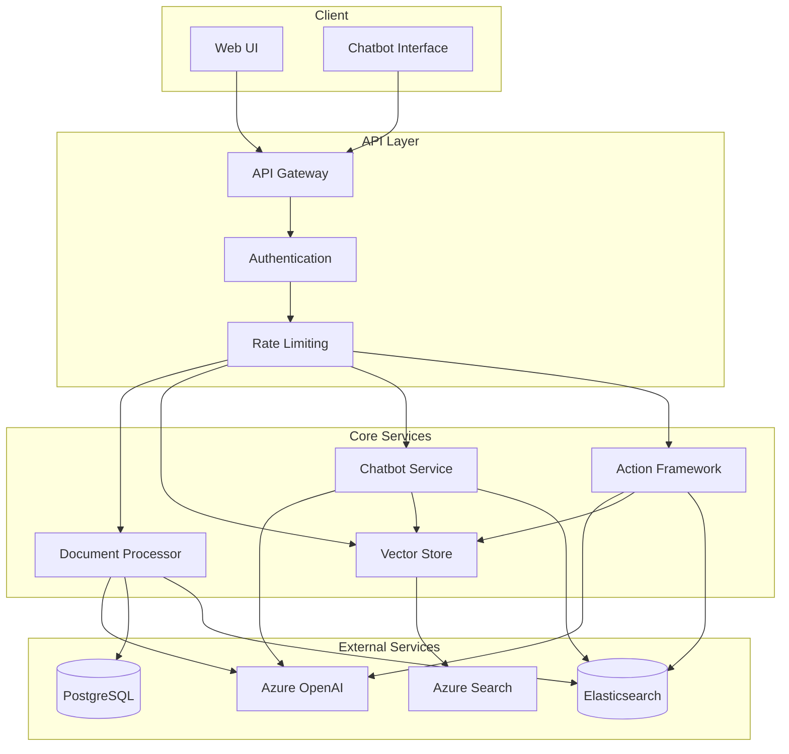
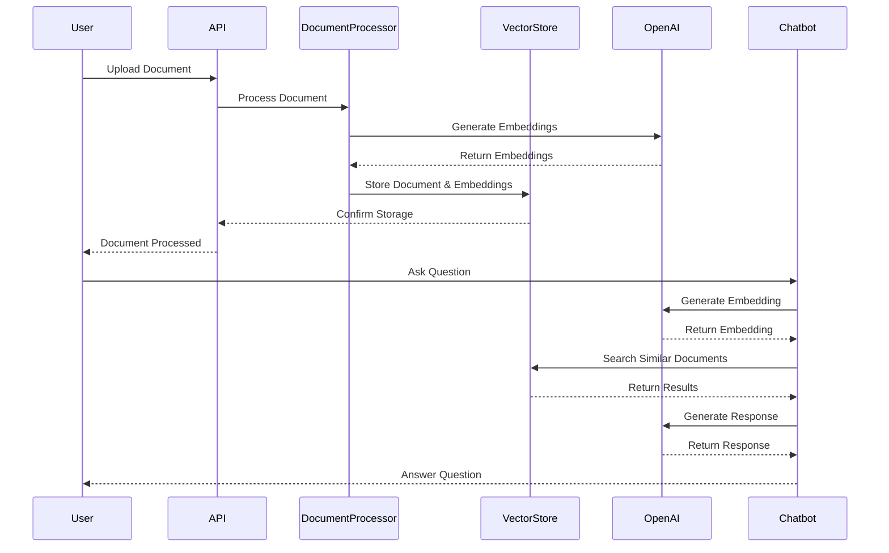
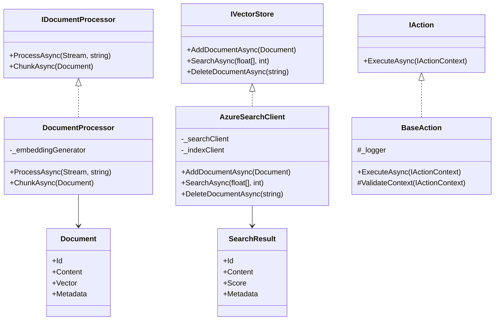

# AI Agent System

## Mục lục
1. [Tổng quan về hệ thống](#1-tổng-quan-về-hệ-thống)
2. [Cấu trúc project](#2-cấu-trúc-project)
3. [User Stories](#3-user-stories)
4. [Sequence Diagram](#4-sequence-diagram)
5. [Class Diagram](#5-class-diagram)
6. [Hướng dẫn chạy project](#6-hướng-dẫn-chạy-project)

## Sơ đồ tổng quan hệ thống



## 1. Tổng quan về hệ thống

AI Agent là một hệ thống thông minh được xây dựng để xử lý và phân tích tài liệu tự động, sử dụng các công nghệ AI tiên tiến. Hệ thống có khả năng:

- Xử lý nhiều định dạng tài liệu (PDF, DOCX, CSV)
- Tự động trích xuất thông tin từ tài liệu
- Chuyển đổi nội dung thành vector embeddings
- Tìm kiếm ngữ nghĩa với Azure Cognitive Search
- Tương tác thông qua chatbot thông minh
- Xử lý các yêu cầu phức tạp thông qua Action Framework

### Kiến trúc hệ thống

Hệ thống được xây dựng theo kiến trúc microservices với các thành phần chính:

1. **API Gateway**
   - Xử lý các request từ client
   - Quản lý authentication và authorization
   - Rate limiting và caching
   - Routing đến các service

2. **Document Processing Service**
   - Xử lý và trích xuất thông tin từ tài liệu
   - Chuyển đổi nội dung thành vector embeddings
   - Lưu trữ metadata và vector trong database

3. **Vector Store Service**
   - Quản lý vector embeddings
   - Tìm kiếm ngữ nghĩa với Azure Cognitive Search
   - Caching và tối ưu hiệu suất

4. **Chatbot Service**
   - Xử lý các câu hỏi từ người dùng
   - Tìm kiếm thông tin liên quan
   - Tạo câu trả lời với GPT-4

5. **Action Framework**
   - Xử lý các yêu cầu phức tạp
   - Điều phối các action
   - Quản lý trạng thái và lỗi

### Công nghệ sử dụng
- .NET 8
- Azure OpenAI (GPT-4)
- Azure Cognitive Search
- PostgreSQL
- Elasticsearch
- Docker
- Azure DevOps

## 2. Cấu trúc project

```
AI.Agent/
├── src/
│   ├── AI.Agent.API/           # Web API project
│   ├── AI.Agent.Core/          # Core business logic
│   ├── AI.Agent.Infrastructure/# External services integration
│   ├── AI.Agent.Domain/        # Domain models & interfaces
│   └── AI.Agent.Application/   # Application services
├── tests/
│   ├── AI.Agent.UnitTests/
│   └── AI.Agent.IntegrationTests/
└── docs/
    └── api/
```

### Chi tiết các project

#### AI.Agent.API
- Controllers
- Middleware
- Filters
- Configuration

#### AI.Agent.Core
- Business logic
- Domain services
- Validation rules

#### AI.Agent.Infrastructure
- Database access
- External service integration
- Logging
- Caching

#### AI.Agent.Domain
- Entities
- Interfaces
- Value objects
- Domain events

#### AI.Agent.Application
- Application services
- DTOs
- Mappers
- Command/Query handlers

## 3. User Stories

### Sprint 1: Core Infrastructure

#### T1.1: Project Setup & Infrastructure
- Là một developer, tôi muốn có một cấu trúc project rõ ràng để dễ dàng phát triển
- Là một developer, tôi muốn có môi trường phát triển được cấu hình đầy đủ
- Là một developer, tôi muốn có pipeline CI/CD để tự động hóa quá trình build và deploy

#### T1.2: Document Processing & Database Infrastructure
- Là một user, tôi muốn upload tài liệu ở nhiều định dạng khác nhau
- Là một user, tôi muốn hệ thống tự động xử lý và trích xuất thông tin từ tài liệu
- Là một user, tôi muốn tìm kiếm tài liệu dựa trên nội dung ngữ nghĩa

#### T1.3: Vector Database & API Integration
- Là một user, tôi muốn tìm kiếm tài liệu tương tự
- Là một developer, tôi muốn có API documentation đầy đủ
- Là một developer, tôi muốn có health check endpoints

#### T1.4: Chatbot Integration
- Là một user, tôi muốn tương tác với hệ thống qua chatbot
- Là một user, tôi muốn chatbot hiểu và trả lời các câu hỏi về tài liệu

### Sprint 2: Action Framework

#### T2.1: Action Framework
- Là một developer, tôi muốn có một framework để xử lý các action phức tạp
- Là một developer, tôi muốn dễ dàng thêm các action mới

#### T2.2: Action Implementation
- Là một user, tôi muốn thực hiện các thao tác phức tạp thông qua chatbot
- Là một user, tôi muốn hệ thống tự động xử lý các yêu cầu của tôi

#### T2.3: Action Orchestration
- Là một developer, tôi muốn quản lý và điều phối các action
- Là một developer, tôi muốn theo dõi trạng thái của các action

#### T2.4: Integration Testing
- Là một developer, tôi muốn đảm bảo tính ổn định của hệ thống
- Là một developer, tôi muốn tự động hóa việc kiểm thử

## 4. Sequence Diagram



## 5. Class Diagram



## 6. Hướng dẫn chạy project

### Yêu cầu
- .NET 8 SDK
- Docker
- PostgreSQL
- Elasticsearch
- Azure OpenAI Service
- Azure Cognitive Search

### Cài đặt

1. Clone repository:
```bash
git clone https://github.com/your-org/ai-agent.git
cd ai-agent
```

2. Cấu hình môi trường:
- Copy `appsettings.Development.json` từ `src/AI.Agent.API/`
- Cập nhật các thông tin cấu hình:
  - Connection strings
  - API keys
  - Service endpoints

3. Chạy database migrations:
```bash
cd src/AI.Agent.API
dotnet ef database update
```

4. Chạy ứng dụng:
```bash
dotnet run
```

### Kiểm tra

1. Health Check:
```bash
curl https://localhost:5001/health
```

2. API Documentation:
- Mở Swagger UI: https://localhost:5001/swagger

3. Unit Tests:
```bash
cd tests/AI.Agent.UnitTests
dotnet test
```

4. Integration Tests:
```bash
cd tests/AI.Agent.IntegrationTests
dotnet test
```

### Docker

1. Build image:
```bash
docker build -t ai-agent .
```

2. Chạy container:
```bash
docker run -p 5000:80 ai-agent
```

### CI/CD

Pipeline được cấu hình trong `azure-pipelines.yml` với các stage:
- Build & Test
- Security Scan
- Deploy to Staging
- Deploy to Production

Để chạy pipeline:
1. Push code lên Azure DevOps repository
2. Pipeline sẽ tự động chạy khi có thay đổi trên branch main hoặc develop 